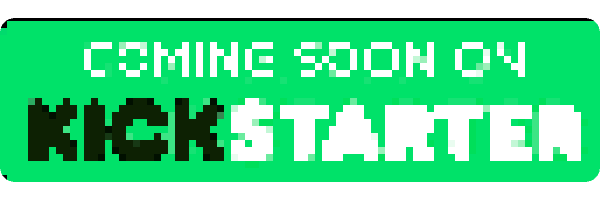

<!--
SPDX-FileCopyrightText: 2023 KOINSLOT, Inc.

SPDX-License-Identifier: GPL-3.0-or-later
-->

<h1 align="left">Welcome to Kywy by KOINSLOT, Inc. 🎮
  
</h1>

  
  Kywy is not just another game engine; it's a learning tool designed to empower beginners to create, share, and explore
  the world of game development. Brought to you by KOINSLOT, Inc., Kywy is all about creativity, collaboration, and
  personal growth.

 

## Explore Kywy: Your Personal Game Development Studio

  

Kywy is crafted to provide an easy and engaging entry into game development. Whether you're a complete beginner or
looking to explore more advanced features, Kywy has something for you.

### Features

- **Beginner-Friendly**: Start creating games with ease, no prior experience required.
- **Share Personally**: Hand your Kywy device to friends and family to share your creations.
- **Grow with Kywy**: Explore more advanced features as you progress, without limitations.

### Get Involved

Want to learn more or contribute to Kywy? Check out our [main repository](https://github.com/KOINSLOT-Inc/kywy) for
more details.

## About KOINSLOT, Inc.

KOINSLOT, Inc. is the proud creator of Kywy, a unique learning tool that brings game development to your fingertips.
We believe in making creativity accessible, personal, and limitless.

[Visit our website](https://www.koinslotkywy.com) to learn more about us and our mission.

---

© 2023 KOINSLOT, Inc. All rights reserved.
